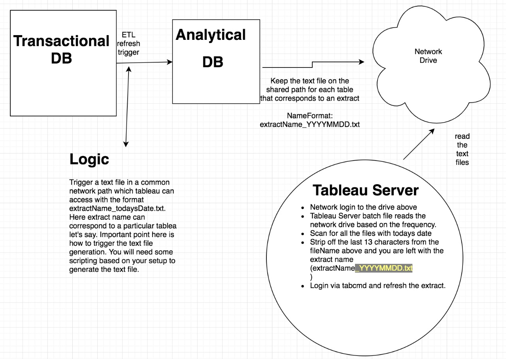

# Tableau-ETL-Chaining
Purpose is to automate extract refresh jobs. A lot of use cases talk about how to automatically chain extract refresh once the ETL job is finished at the Analytical DB level

**Folder Description**: 
/Tableau/ >> Contains the flag files that are copied from Network shared Path 
/Tableau/Logs/ >> Logs files are generated here 

**File Description**: 
ETLChaining.bat >> Main file, make changes here. 
Mailer.ps1 >> Make changes for the mail to be triggered in case of failure. 
logger.bat >> This calls the ETLChaining.bat file and generates the log. Also this is the only file to be utilized to be configured in the Windows Scheduler 

